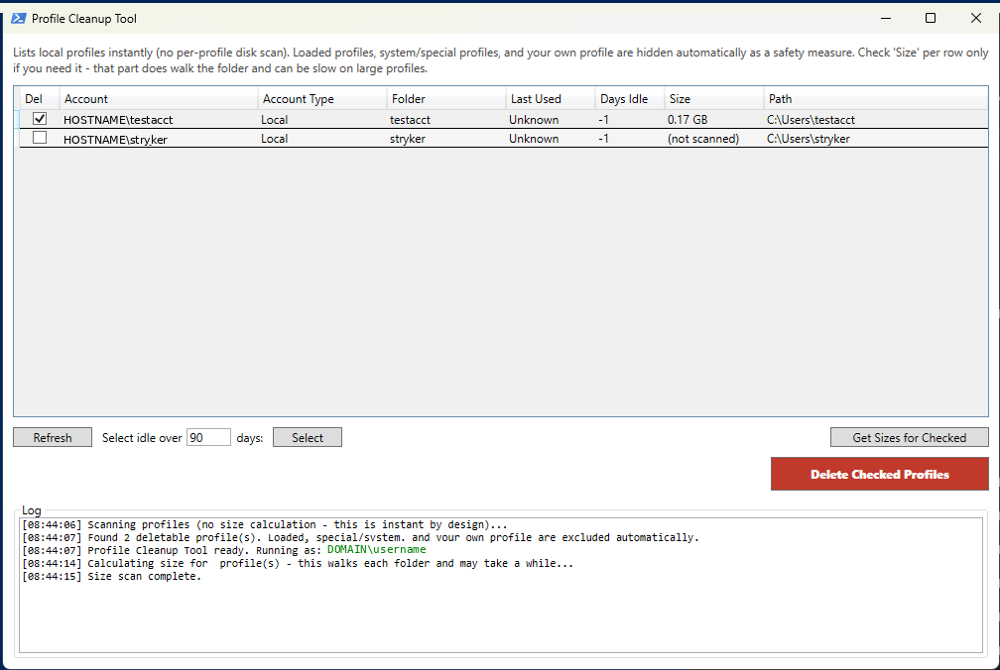
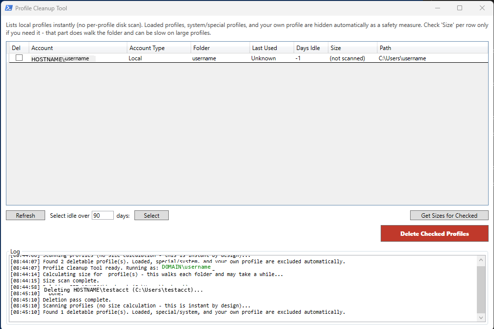

# Profile Cleanup Tool

**Fast, safe removal of stale local and domain user profiles from a shared or multi-user Windows device.**

## Why this exists

This is the companion tool to the [Profile Rebuild Tool](https://github.com/t-source95/Windows-Profile-Rebuild-Tool): that tool fixes one corrupted profile in place, while this one removes leftover profiles entirely from a device that's accumulated them over time — shared workstations, kiosks, loaner laptops, or machines reassigned between employees without a clean reimage in between.

The built-in way to do this is Windows' own Advanced System Settings → User Profiles dialog. The problem is that before it can even show you the list, it recursively walks every profile folder on disk to calculate a Size column — which on a device with several leftover profiles (or a couple of large ones) can make the dialog sit there looking frozen for a noticeable stretch. That's not a fault with the machine; it's just how that dialog is built. This tool reads the same underlying profile data (`Win32_UserProfile`) but skips the up-front size scan, so the list loads instantly, and deletion runs through the same call the native dialog's Delete button uses under the hood — so it isn't a more aggressive way to delete a profile, just a faster path to the same action, with some safety guardrails layered on top.

> **Scope note:** Like the Rebuild Tool, this touches the local machine only. It reads and deletes local `Win32_UserProfile` entries on the machine it's run on — it does not reach out to Active Directory, Entra ID, or any domain controller to modify or remove the underlying account.

---

## Table of Contents

- [When to Use This](#when-to-use-this)
- [Prerequisites](#prerequisites)
- [Resolution](#resolution)
  - [Method 1 (Recommended): Profile Cleanup Tool](#method-1-recommended-profile-cleanup-tool)
  - [Method 2 (Secondary/Manual): Elevated PowerShell Script](#method-2-secondarymanual-elevated-powershell-script)
  - [Method 3 (Fallback): Windows Advanced System Settings](#method-3-fallback-windows-advanced-system-settings)
- [Safety Notes](#safety-notes)
- [Troubleshooting](#troubleshooting)
- [Appendix: Technical Reference](#appendix-technical-reference)
- [Testing Checklist Before Using on a Live Device](#testing-checklist-before-using-on-a-live-device)

---

## When to Use This

Reach for this tool whenever a device has one or more local user profiles that are no longer needed and are safe to remove — most commonly:

- A shared or kiosk-style machine that's been logged into by several people over time
- A laptop being reassigned to a new employee that still has the previous owner's profile on it
- General profile sprawl cleanup as part of routine device maintenance

This is a distinct problem from a single corrupted profile — if only one user's profile is broken and needs to be *fixed*, use the [Profile Rebuild Tool](../profile-rebuild-tool/README.md) instead. Use this tool when the goal is to remove profiles outright, not repair one.

*Category: Desktop Support – General Windows Profile Management · Applies to: Windows 10/11*

## Prerequisites

> **Only delete user profiles while logged in as an administrator.** All three methods below require local admin rights, and profile deletion cannot be undone once confirmed.

- Local administrator rights on the target machine
- The profile(s) you intend to delete should not currently be logged in — an active profile cannot be deleted by any of these methods
- Confirm against a ticket, asset record, or the site's user list which accounts are actually safe to remove before deleting — see [Safety Notes](#safety-notes)

## Resolution

There are three ways to remove a stale profile, in order of preference:

- **Method 1 (recommended)** — the Profile Cleanup Tool. Instant profile listing, built-in safety exclusions, and a confirmation step before anything is deleted.
- **Method 2 (secondary/manual)** — a short elevated PowerShell script. Use this if the tool isn't available on the machine, or you just need to check/remove one profile by hand.
- **Method 3 (fallback)** — the native Windows dialog. Works everywhere with no script required, but is notorious for being slow to open — see the note in that section for why.

### Method 1 (Recommended): Profile Cleanup Tool

A PowerShell + WPF GUI tool that lists every deletable local profile instantly, flags whether each one is a Local, Domain (AD), or Entra ID account, and lets you multi-select and delete with one confirmation step.

#### Requirements

- Must be run **locally** on the target machine
- Must be run **elevated** — the tool self-elevates via UAC if it isn't already
- Any profile you want to delete must not currently be loaded (logged in) — loaded profiles are hidden from the list automatically

#### Running the Tool

```powershell
powershell.exe -ExecutionPolicy Bypass -File .\ProfileCleanupTool.ps1
```

#### Usage

1. Launch the tool. On startup it scans and displays every deletable profile — profiles that are currently loaded, Windows special/system profiles, and the profile you're currently running the tool as are excluded automatically and will never appear in the list.

   

2. **(Optional)** Enter a number of days in **"Select idle over ___ days"** and click **Select** to auto-check every profile idle for at least that long. You can still manually check/uncheck individual rows afterward.
3. **(Optional)** Check the profiles you want disk-usage info for and click **"Get Sizes for Checked."** Size isn't calculated automatically — that's the slow part this tool otherwise avoids — so it only runs for rows you explicitly ask about.
4. Check the **Del** box on each profile you want removed. Double-check the **Account** and **Account Type** columns first, especially for Domain (AD) or Entra ID accounts.
5. Click **"Delete Checked Profiles."** A confirmation dialog lists every account that will be removed — review it carefully, since this is permanent. Confirming deletes both the profile folder on disk and its registry entry for each selected profile.
6. The grid refreshes automatically once deletion completes, so removed profiles disappear from the list. Check the Log panel to confirm each one shows "Done" rather than a failure message.

   

### Method 2 (Secondary/Manual): Elevated PowerShell Script

Use this if the tool isn't available on the machine, or you just need to check/remove one profile by hand. Open PowerShell as Administrator, then run the following.

**1. List profiles to identify the right one:**

```powershell
Get-CimInstance -Class Win32_UserProfile | Select-Object LocalPath, SID, LastUseTime
```

Note the exact `LocalPath` of the profile you intend to remove before continuing.

**2. Delete the specific profile by matching the folder name:**

```powershell
Get-CimInstance -Class Win32_UserProfile | Where-Object {$_.LocalPath -like "*USERNAME*"} | Remove-CimInstance
```

Replace `USERNAME` with the folder name identified in step 1.

> **Caution — wildcard matching:** `-like "*USERNAME*"` matches any profile whose path *contains* that text, so a short or common name (e.g. `"john"`) can also match an unrelated profile (e.g. `"johnson"`). Run the listing command first, confirm the exact `LocalPath` you want, and use the narrowest match that still uniquely identifies that one profile — or compare against the full path with `-eq` instead of `-like` if there's any ambiguity.

### Method 3 (Fallback): Windows Advanced System Settings

The built-in Windows dialog. Works on any Windows machine with no script required, but is notorious for being slow or appearing to hang — try Method 1 or Method 2 first if that's a problem.

1. Search Windows for **"advanced system settings"** and open it.
2. On the **Advanced** tab, under **User Profiles**, click **Settings**.
3. Select the profile you want to remove, click **Delete**, and confirm.

> **Why this is slow:** before this dialog can display its list, it recursively calculates the on-disk size of every profile on the machine. On a device with several leftover profiles, or large ones, that scan can make the dialog appear frozen for a noticeable stretch. This is expected behavior for this dialog, not a fault with the machine — it will complete, but Method 1 avoids the wait entirely by not calculating size up front.

## Safety Notes

Method 1 (the Profile Cleanup Tool) automatically excludes the following from its list, so they cannot be selected for deletion:

- Any profile that is currently loaded (a user is logged in, or a process is still holding the profile open)
- Windows special/system profiles (`SYSTEM`, `LocalService`, `NetworkService`, `DWM-*`, `defaultuser0`, etc.)
- The profile of whichever account is currently running the tool

Methods 2 and 3 do **not** enforce these exclusions automatically — when using the manual script or the Advanced System Settings dialog, verify by hand that the profile you're removing is not loaded, is not a system profile, and is not the account you're currently logged in as.

> **Deletion is permanent.** There is no undo. Whichever method you use, the confirmation step is the only checkpoint before data loss, so read the account/profile name carefully before confirming — particularly on devices with multiple similarly-named accounts.

## Troubleshooting

**A profile fails to delete.**
The Log panel shows the specific error for that profile rather than failing silently. The most common cause is another process still holding a handle open inside the profile — antivirus scanning, a stuck service running under that account, or a scheduled task. Close/stop the offending process, click **Refresh**, and retry.

**A domain account shows as `(unresolved - SID)`.**
This means the SID couldn't be translated to an account name — either the machine can't currently reach a domain controller, or the account has since been deleted from Active Directory / Entra ID. This is expected for former employees' accounts and does not prevent deletion; the tool operates on the SID/CIM object, not the resolved name.

**Account Type shows `Unknown`.**
The tool determines Local vs. Domain by comparing a profile's SID against the local machine's own SID, pulled from the built-in Administrator account. If that lookup fails (check the Log panel for the specific error), Account Type falls back to `Unknown` rather than guessing — verify manually via the SID before deleting if this occurs.

---

## Appendix: Technical Reference

This section documents how the tool works internally. It's intended for anyone maintaining or extending the script — not required reading to simply run it.

### Architecture Overview

Same pattern as the Rebuild Tool: a single `.ps1` file with no external dependencies beyond what ships with Windows. The GUI is WPF, defined as an in-line XAML string and parsed at runtime via `System.Windows.Markup.XamlReader` — no compiled `.exe` or code-behind class involved. See the Rebuild Tool's [Core Technique: Hosting WPF Inside a Plain `.ps1`](../profile-rebuild-tool/README.md#core-technique-hosting-wpf-inside-a-plain-ps1) section for the shared mechanics (XAML loading, event wiring via `.Add_Click()`, self-elevation via `-Verb RunAs`); this appendix covers only what's specific to this tool.

### Why the Profile Scan Is Instant

The native Advanced System Settings dialog (Method 3) is slow because, before it renders anything, it walks every profile folder on disk to compute a Size column. This tool queries the exact same source — `Get-CimInstance -ClassName Win32_UserProfile` — but never touches the filesystem during the initial scan. `LocalPath`, `SID`, `LastUseTime`, `Loaded`, and `Special` are all metadata the CIM provider already has in memory; no directory walk is required to read them. Size is deliberately left as `(not scanned)` until the user opts in per-row via **"Get Sizes for Checked,"** at which point `Get-ChildItem -Recurse | Measure-Object -Property Length -Sum` runs only against the folders actually requested.

### Deletion Mechanism

```powershell
Remove-CimInstance -InputObject $row.CimRef
```

This is the same underlying call the native dialog's Delete button makes: it removes both the registry `ProfileList` entry and the profile folder on disk in one operation. Using `Remove-CimInstance` directly on the `Win32_UserProfile` instance means this tool isn't a more aggressive or lower-level deletion path than the built-in UI — it produces an identical end state, just without the up-front size-scan delay.

### Account Type Detection

A local SID and a domain SID share the exact same shape — `S-1-5-21-<id1>-<id2>-<id3>-<RID>` — so the structure alone can't distinguish them. What does: every local account on a given machine shares the same `<id1>-<id2>-<id3>` "machine SID" prefix, and that prefix is always different from the domain's. The tool pulls the machine's own prefix once per scan from a known-local account — the built-in Administrator, RID 500, which is always local even on a domain-joined box — and compares every profile's SID against it:

```powershell
function Get-LocalMachineSidPrefix {
    $localAdmin = Get-CimInstance -ClassName Win32_UserAccount `
        -Filter "LocalAccount='True' AND SID LIKE 'S-1-5-21-%-500'" |
        Select-Object -First 1
    if ($localAdmin -and $localAdmin.SID) {
        return $localAdmin.SID.Substring(0, $localAdmin.SID.LastIndexOf('-'))
    }
}

function Get-AccountType {
    param([string]$SID, [string]$LocalMachinePrefix)
    if ($SID -match '^S-1-12-1-') { return "Entra ID (Azure AD)" }
    if ($SID -match '^S-1-5-21-') {
        $prefix = $SID.Substring(0, $SID.LastIndexOf('-'))
        if ($LocalMachinePrefix -and $prefix -eq $LocalMachinePrefix) { return "Local" }
        else { return "Domain (AD)" }
    }
    if ($SID -match '^S-1-5-(18|19|20)$') { return "System" }
    return "Unknown"
}
```

`S-1-12-1-` SIDs are flagged separately as Entra ID (Azure AD) — a distinct format used by Entra-only-joined devices, as noted in the Rebuild Tool's [AD / Domain Account Support](../profile-rebuild-tool/README.md#ad--domain-account-support) section. If the machine-prefix lookup itself fails (e.g. no local accounts match the filter), Account Type falls back to `Unknown` for every row rather than guessing.

### SID Resolution and Orphaned Accounts

The tool attempts to resolve each profile's SID to a friendly account name via `.Translate([Security.Principal.NTAccount])`. On a machine that's cycled through several users, it's common for this to fail — the account may have been deleted from AD/Entra, or the machine may be offline from the domain at scan time. Rather than erroring out, unresolvable profiles display as `(unresolved - SID)` and remain fully selectable for deletion, since the underlying `Remove-CimInstance` call operates on the CIM object/SID directly and never depends on the friendly name resolving.

### Safety Exclusions

The initial CIM query filters out loaded, special, and current-user profiles before they ever reach the grid:

```powershell
Get-CimInstance -ClassName Win32_UserProfile |
    Where-Object { -not $_.Special -and -not $_.Loaded -and $_.SID -ne $script:CurrentUserSID }
```

This mirrors the same category of guardrail the Rebuild Tool applies around requiring a separate admin account rather than the affected user's own session — both tools avoid letting an operator accidentally act on the session they're currently running in.

## Testing Checklist Before Using on a Live Device

1. Create a couple of throwaway local test accounts, log into each once, then log off
2. Run the Profile Cleanup Tool and confirm both test accounts appear in the list with correct Last Used / Days Idle values
3. Confirm your own currently-logged-in profile does **not** appear in the list
4. Select one test profile, delete it, and confirm the folder and registry entry are actually gone (`C:\Users\<name>` and the corresponding `ProfileList` SID key)
5. Only then use it against real stale profiles on a live device
